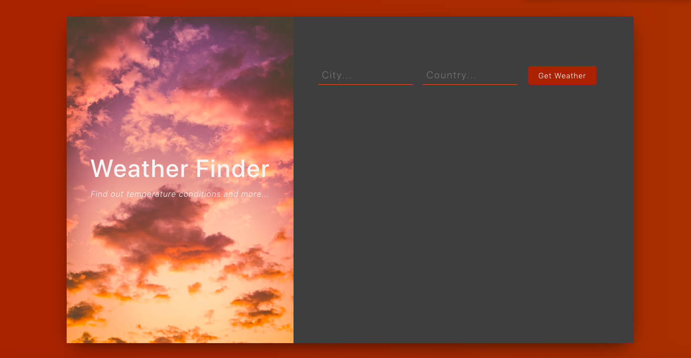
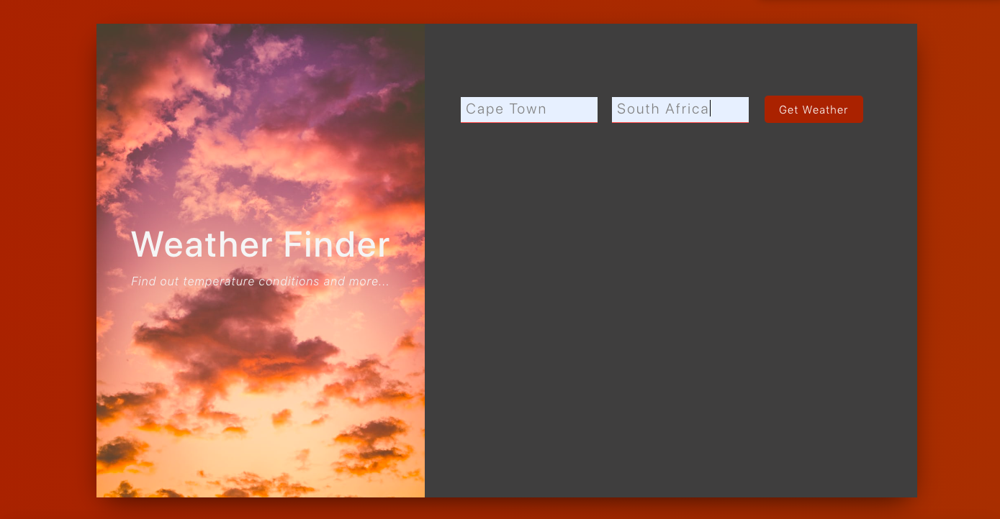

# Weather App - React.js

## Description
This app was created using React.js and uses OpenWeatherMap API to display the weather in a city of the user's choice. The user is able to enter the name of the city of their choice to display the weather information of the chosen city.

Check out the [Weather App](https://weather-app-eight-ecru.vercel.app) here.

## Installation

Navigate to the project root folder, in your terminal type in `npm install`.
To run this app type `npm start`, you can then open your browser to `http://localhost:3000`.

## Usage
### Landing Page
The landing page displays a form where the user can type in a the city and country.

###  Add name of city
After typing the city and country the user will need to press the "Get Weather" button to view the weather of the chosen city.

###  Details Page
After clicking the "Get Weather" button, the weather information will be displayed. 

## Credits
Created by [@MelissaAppolis](https://github.com/MelissaAppolis)